# Project BLOCKCHAIN

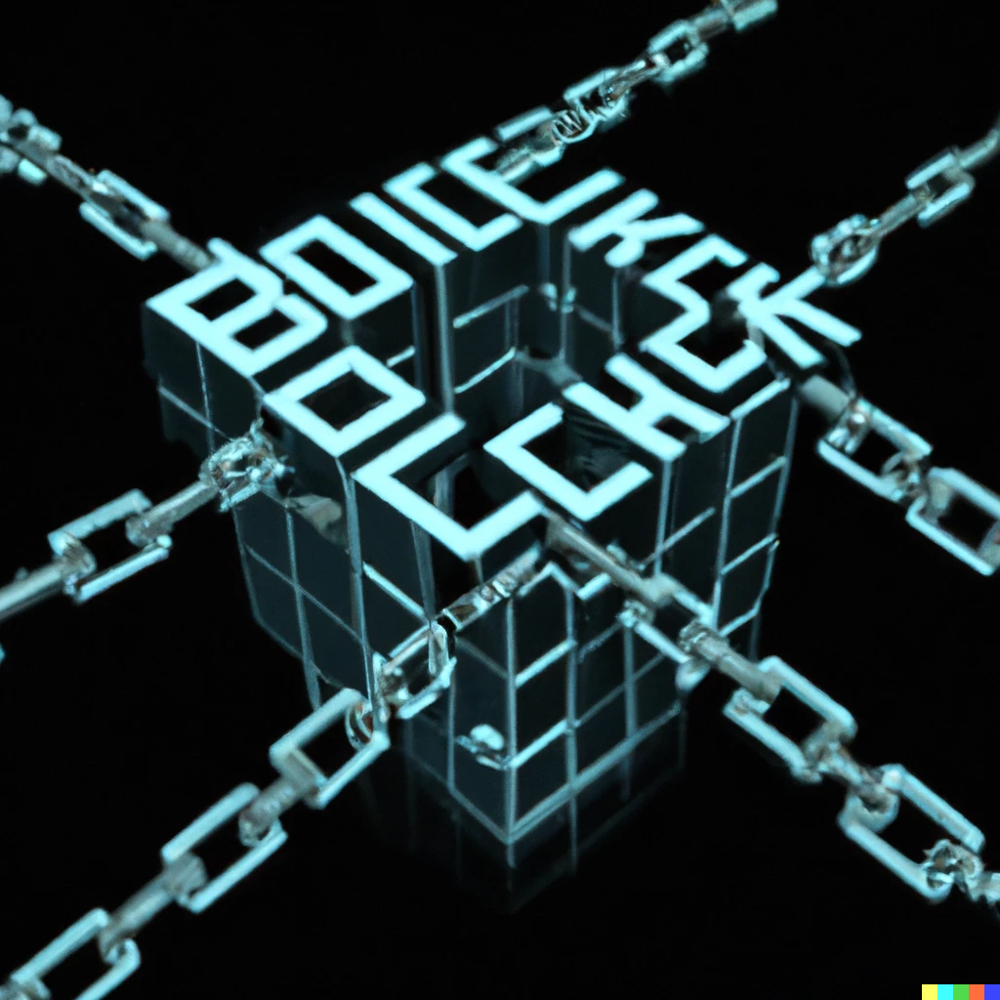

*Generado por sistema CLIP DALL-E-*

## Introducción

Este proyecto tiene como objetivo desarrollar una aplicación transaccional que permita la interacción de datos de forma segura mediante el uso de tecnología blockchain. Para lograrlo, se implementaron varias estructuras de datos abstractas personalizadas, cuidadosamente seleccionadas por su idoneidad y sus beneficios teóricos.

La seguridad y confiabilidad de la aplicación son esenciales, por lo que se eligió una estructura de datos de cadena de bloques para garantizar la integridad de los datos y la inmutabilidad de las transacciones. Además, las estructuras de datos customizadas permiten una mayor eficiencia en la interacción de los datos, mejorando la escalabilidad y el rendimiento del sistema.

En resumen, este proyecto representa una oportunidad para explorar las ventajas de la tecnología blockchain y su aplicación en una aplicación transaccional segura y eficiente.


## Descripción
Este proyecto es una implementación básica de una cadena de bloques que registra transferencias y busca información en la cadena.


El programa lee información de un archivo CSV que contiene transferencias bancarias y los almacena en una estructura de datos de tipo CircularArray. Una vez que se alcanza el número de transferencias necesario, se crea un nuevo bloque con ellas y se agrega a la cadena de bloques.

Además, el programa proporciona la capacidad de buscar en la cadena de bloques en función de ciertos criterios, como la cantidad de transferencias entre un rango de fechas, aquellas que contienen un cierto prefijo o el monto mínimo y máximo de una transferencia.

El programa también incluye un menú que permite al usuario buscar, eliminar y minar nuevos bloques en la cadena-

Las 10 000 observaciones en el archivo CSV fueron generadas con el simulador [Generate Data](https://generatedata.com/generator),donde es posible definir los atributos a necesitar.

## Relevancia

Por medio de este proyecto, se puede conocer a mayor detalle en la práctica el uso de las estructuras de datos aprendidas en el curso, así como el lidiar con debilidades que algunas presentan en los casos de implementación; en resumen a través del desarrollo de este, se llega a conocer cabalmente los pormenores de las estructuras de datos.

## Descripción del problema

El problema principal que se aborda es la falta de confianza en los sistemas centralizados y la necesidad de una solución más transparente y confiable. Para lograr esto, se utilizará la tecnología de blockchain, que es una base de datos descentralizada y segura que almacena registros en bloques enlazados en una cadena. Esto nos lleva a un segundo problema que es el implementar estructuras de datos eficientes para la implementación de las cadenas de bloques así como de las operaciones a relizar en ellas.

## Objetivos

    
    1. Implementar una estructura de datos de cadena de bloques para garantizar la inmutabilidad y seguridad de la información almacenada.
    
    2. Implementar estructuras de datos a fin de que se puedan relizar operaciones en las cadenas de bloques.

    3. Desarrollar un programa que permita al usuario gestionar y almacenar datos de forma segura utilizando la tecnología blockchain.
    
    
## Clases

   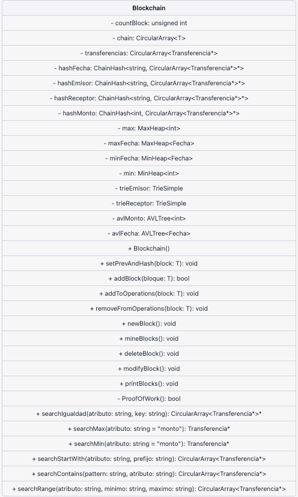
   
   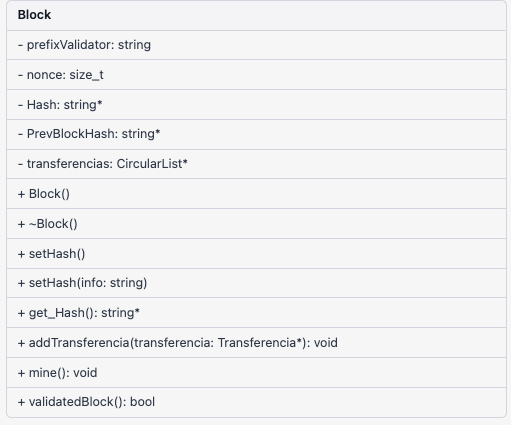
   
   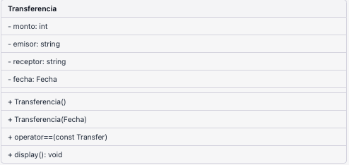
   
   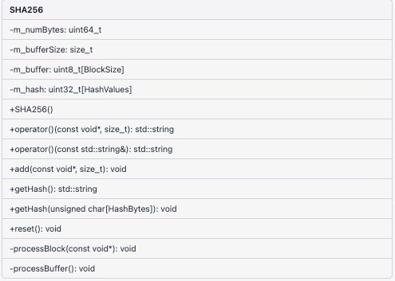
   
   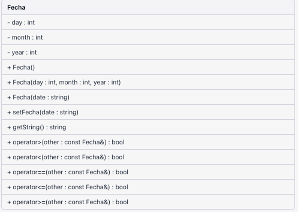


   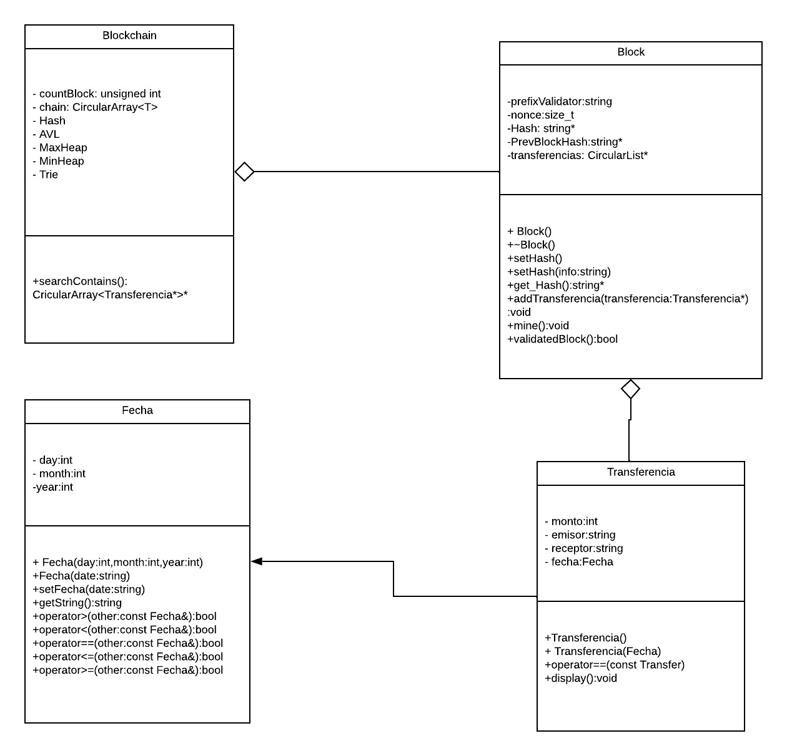

    
    
## Pasos para ejecutar el programa

### Desde Terminal

Utilizando el repositorio de manera local, correr el archivo `main.cpp`. Esto desde el IDE de su preferencia o directamente desde terminal con los comandos que usualmente ejecuta. Se podrá visualizar entonces la creación de los bloques y finalmente el Menú Principal.
   
   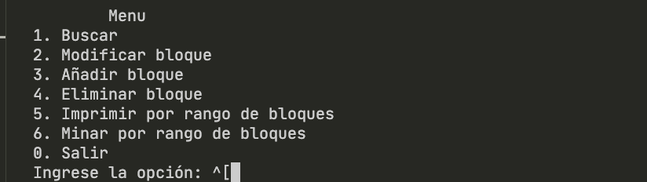

### Utilizando Interfaz Gráfica

Utilizando el framework Qt y cargando los archivos del repositorio junto a los de la carpeta `InterfazGrafica`, es posible acceder a un menú interactivo con opciones accesible para el usuario de manera intutiva.

   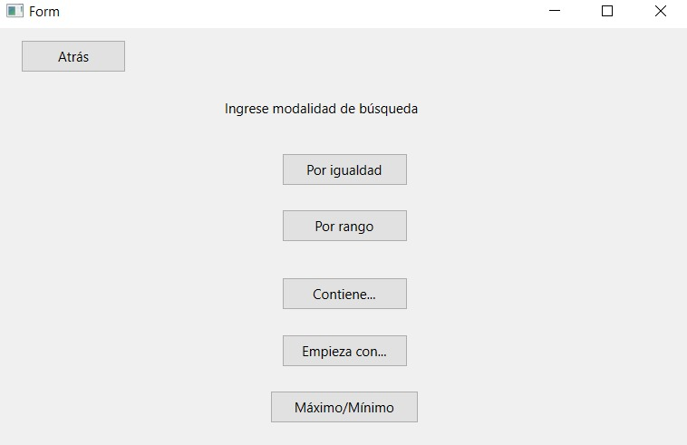

## Explicación de la estructura de datos del Blockchain y la estrategia para asegurar la integridad de su contenido.

El Blockchain es una base de datos distribuida y descentralizada que se utiliza para almacenar información de manera segura y transparente. En ella se registran transacciones, contratos y otros tipos de datos de forma cronológica, lo que permite asegurar su integridad y evitar que se modifiquen o eliminen.

La estructura de datos del Blockchain se organiza en bloques, que contienen información sobre las transacciones realizadas. Cada bloque está conectado al anterior, formando una cadena de bloques (de ahí el nombre de Blockchain). Cada bloque contiene un conjunto de transacciones y un hash, que es un código alfanumérico que se genera a partir de la información contenida en el bloque. Este hash es único para cada bloque y se utiliza para verificar la integridad de la información almacenada en el mismo.

   
### Proof of work

La estrategia utilizada para asegurar la integridad del contenido del Blockchain se conoce como "proof of work" o "prueba de trabajo". Consiste en que los nodos de la red (los ordenadores que participan en el mantenimiento de la red Blockchain) compiten por resolver un complejo problema matemático. 

Este proceso de "prueba de trabajo" es muy difícil y consume mucha energía, lo que hace que sea muy difícil para un atacante manipular la información almacenada en el Blockchain. Además, como cada bloque está conectado al anterior, si alguien intenta modificar un bloque, esto afectará a todos los bloques posteriores, lo que hace que sea muy difícil realizar una modificación sin ser detectado.

En este programa se implementa una versión básica del mecanismo Proof of Work (PoW) para garantizar la seguridad y la inmutabilidad de la cadena de bloques. El proceso de minería se implementa en la función mine() de la clase Block. El objetivo es encontrar un número entero llamado "nonce" tal que, cuando se concatena con la información de la transferencia y se calcula el hash SHA-256 de la cadena resultante, el hash comience con un número determinado de ceros (el prefijo de validación), que por defecto en nuestro programa son 3 ceros. El algoritmo utiliza un bucle while que incrementa el valor del nonce en cada iteración hasta que se encuentra un hash que comienza con el prefijo de validación. Cuando se encuentra un hash válido, se establece como el hash del bloque actual.

En resumen, el proceso de minería en esta implementación Proof of Work se basa en la fuerza bruta para encontrar un valor de nonce que permita generar un hash válido para el bloque, y así garantizar que la información de la cadena de bloques sea inmutable y resistente a la manipulación.

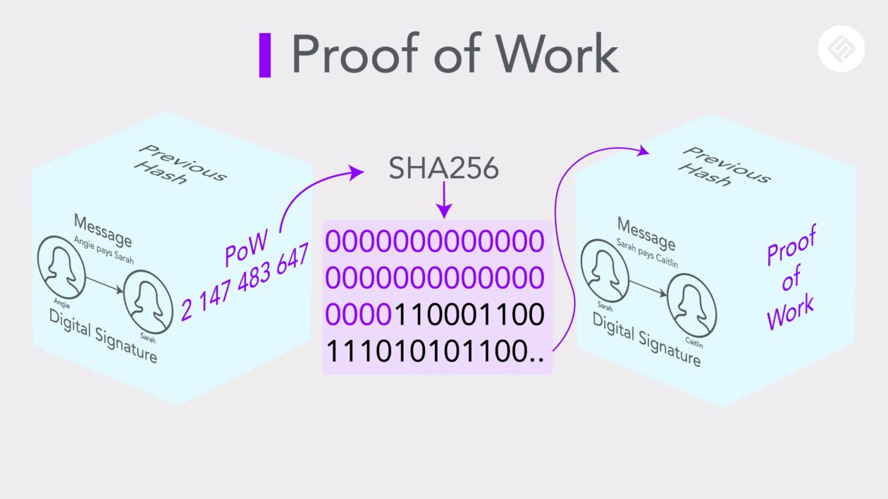

## Estructuras de Datos implementadas

Para poder implementar las cadenas de bloques así como los métodos de las clases utilizadas, se utilizaron las siguientes estructuras de datos:

- MaxHeap

    Dos árboles MaxHeap que permiten obtener el máximo monto de transferencia y la fecha más reciente respectivamente.

    ```c++
    MaxHeap<int> max; 
    MaxHeap<Fecha> maxFecha; 
    ```
    
    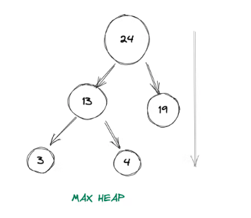


- MinHeap

     Dos árboles MinHeap que permiten obtener el mínimo monto de transferencia y la fecha más antigua respectivamente.

    ```c++
    MinHeap<Fecha> minFecha; 
    MinHeap<int> min; 
    ```
    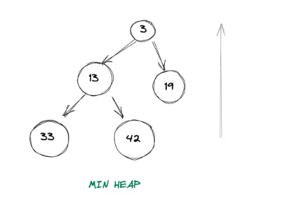

- Árbol AVL
    
    Dos árboles AVL que permiten buscar transferencias por monto y fecha.

     ```c++
    AVLTree<int> *avlMonto; 
    AVLTree<Fecha> *avlFecha; 
    ```
   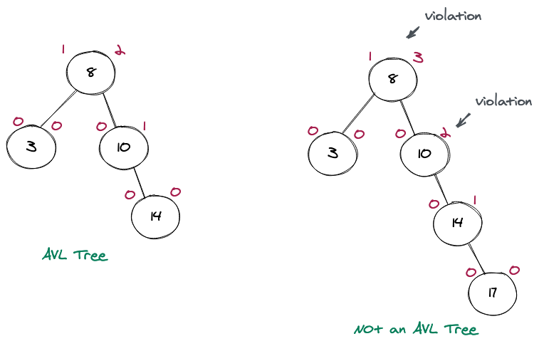


- Trie Simple

    Dos árboles trie simples que permiten buscar transferencias por emisor y receptor.

    ```c++
    TrieSimple *trieEmisor; 
    TrieSimple *trieReceptor; 
    ```
    
    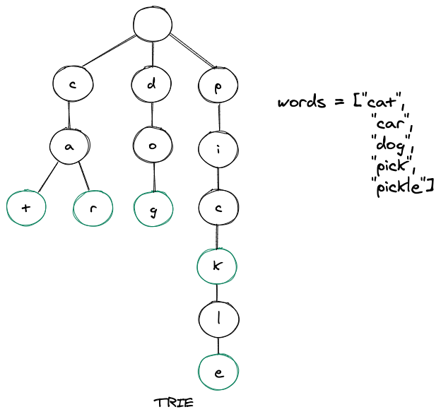


- Circular Array

   Se utilizó un array circular para almacenar los bloques de la cadena de bloques, ya que al ser una estructura de datos lineal, permite acceder a los elementos de forma secuencial. Además, al ser circular, permite que el primer elemento se conecte con el último, formando una cadena de bloques.

    ```c++
    CircularArray<T> chain;
    ```

    Uno que contiene todas las transferencias realizadas en el BlockChain.

    ```c++
    CircularArray<Transferencia*> transferencias;
    ```
    
    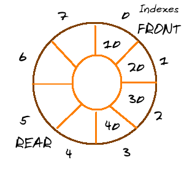

    

- ChainHash

    Cuatro tablas hash ChainHash que permiten buscar transferencias por fecha, emisor, receptor y monto. Siendo utilizadas para la búsqueda por igualdad.

    ```c++
    ChainHash<string, CircularArray<Transferencia*>*> *hashFecha; 
    ChainHash<string, CircularArray<Transferencia*>*> *hashEmisor; 
    ChainHash<string, CircularArray<Transferencia*>*> *hashReceptor; 
    ChainHash<int, CircularArray<Transferencia*>*> *hashMonto; 
    ```
    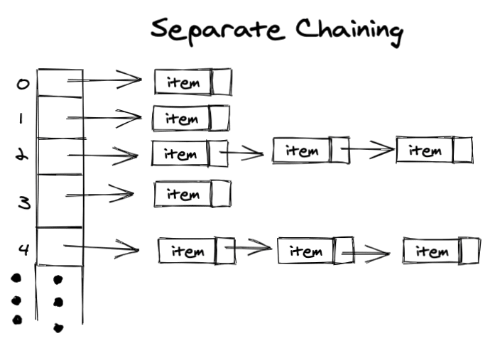
    

## Funciones

- Se utilizó la función de Boyer-Moore para buscar patrones en los archivos de entrada. Dicha función es requerida en la búsqueda por contenido. Se decidió utilizar esta función en lugar de usar un sufix tree, ya que el tiempo de ejecución de la función es menor que el tiempo de ejecución de un sufix tree. De esta forma, se logra un mejor rendimiento en la búsqueda por contenido.

    ```c++
    bool boyerMoore(string text, string pattern);
    ```

## Complexity


- Insert (block)
    
    La complejidad de la inserción de bloques es O(4log n), que es O(log n), donde el log n es porque las indexaciones que más tiempo demoran son las del heap y las del avl. Para el nùmero de transferencias que se manejó esto fue aproximadamente constante.
    
    
- Eliminar (block)

    La complejidad es O(4 * 4k) -> O(k), donde k es la cantidad de transferencias en las que aparece.


- Igual a X

    La complejidad de esta función es O(1), ya que se utiliza una tabla hash para buscar las transferencias en las que aparece un emisor o receptor por igualdad.

    ```c++
        CircularArray<Transferencia*>* searchIgualdad(string atributo, string key);
    ```

- Entre X y Y 

    La complejidad de esta función es O(logn + k), donde k es la cantidad de elementos dentro del rango, gracias a que usamos un AVL.

    ```c++
        CircularArray<Transferencia*> searchRange(string atributo, string minimo, string maximo);
    ```

- Inicia con

    La complejidad de esta función es O(m), siendo m el tamaño de la palabra más larga con ese prefijo. Ya que se utiliza un trie simple para buscar la transferencia por prefijo.

    ```c++
        CircularArray<Transferencia*> searchStartWith(string atributo, string prefijo)
    ```

- Está contenido en

    La complejidad de esta función es O(4n * E) -> O(n) siendo E el tamaño de la palabra más larga.
        
    ```c++
        CircularArray<Transferencia*> searchContains(string pattern,string atributo);
    ```

- Máximo valor de
    
   La complejidad de esta función es O(1).

    ```c++
        Transferencia* searchMax(string atributo="monto");
    ```

- Mínimo valor de
    La complejidad de esta función es O(1).

    ```c++
        Transferencia* searchMin(string atributo="monto");
    ```


## Conclusión

En este proyecto se ha implementado una estructura de datos tipo Blockchain en C++. Se ha utilizado una variedad de estructuras de datos, como arrays circulares, tablas hash, árboles AVL, tries simples y heaps, para almacenar y organizar la información de las transferencias realizadas en la cadena de bloques.

Se ha implementado la funcionalidad de crear nuevos bloques y verificar la integridad de la cadena de bloques mediante la comprobación de la prueba de trabajo. También se han agregado las transferencias a las estructuras de datos correspondientes y se han implementado funciones para buscar y obtener información de las transferencias.

El proyecto ha demostrado la utilidad de la estructura de datos tipo Blockchain en la implementación de sistemas de registro y transacciones seguros y confiables. Además, se ha destacado la importancia de utilizar diferentes tipos de estructuras de datos para manejar y organizar grandes cantidades de datos de manera eficiente.

En resumen, el proyecto ha sido una valiosa experiencia para la implementación de una estructura de datos tipo Blockchain y el uso de diferentes tipos de estructuras de datos aprendidas en el curso.


## Biografy references
    
    Allen Weiss, M. (2014). *Data structures and algorithm analysis in C++* (4th ed.). Pearson Education, Inc.
    
    Antonopoulos, A. M. (2018). *Mastering blockchain: Distributed ledger technology, decentralization, and smart contracts explained* (2nd ed.). O'Reilly Media, Inc.

    generatedata.com. (s. f.). Recuperado de https://generatedata.com/generator


## Index integrants activity
    
Para la distribución de tareas, se utilizó la sección de *Projects* de GitHub aplicando la plantilla *Basic Kanban*.

- Link directo: [Sección Projects](https://github.com/orgs/utec-cs-aed-2023-0/projects/1/views/1)


